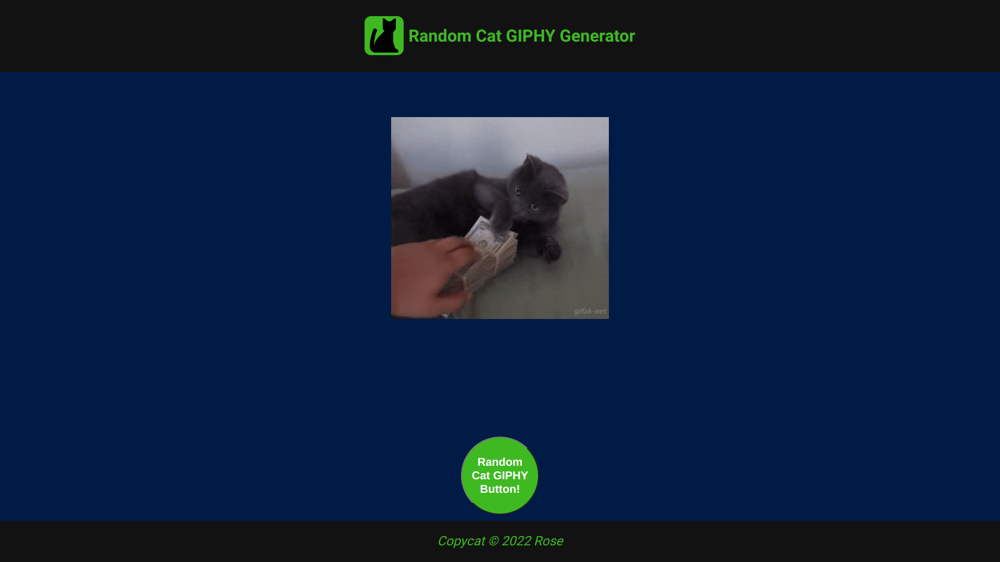
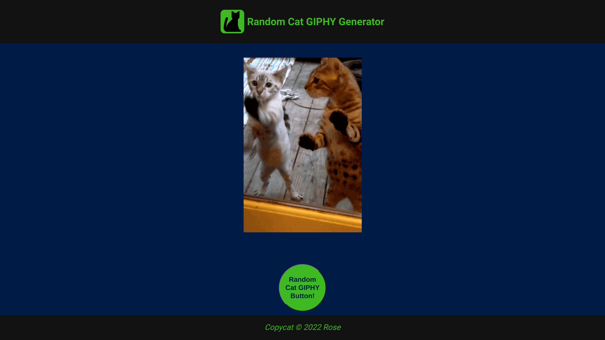
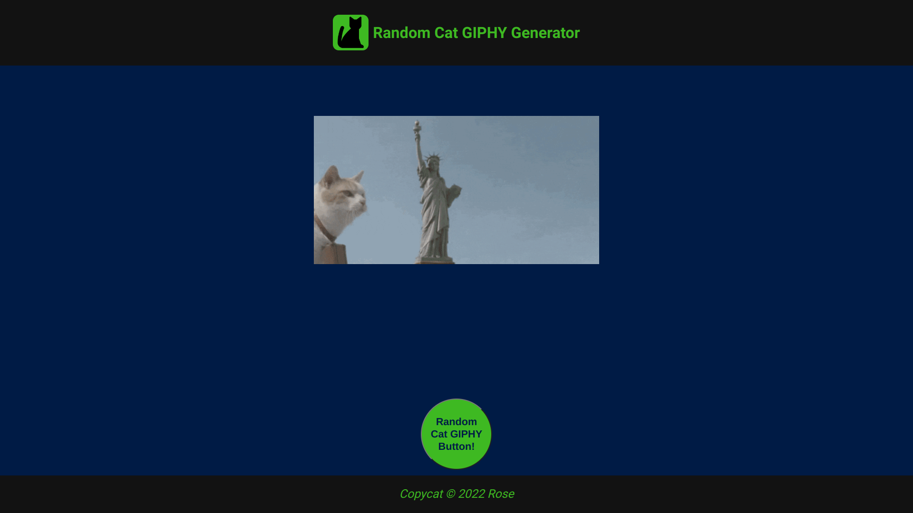

# Random Cat GIF Generator 

[Link to live demo.](https://rosendo-martinez.github.io/giphy-api-project/) 👈

This is a quick project I made to practice using APIs, specifically the [GIPHY API](https://developers.giphy.com/docs/api#quick-start-guide).

# Screenshots 

&ensp;

&ensp;
